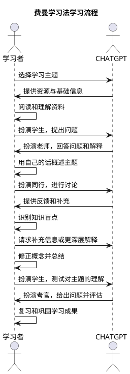

在当今的科技时代，人工智能（AI）的迅猛发展重新定义了我们学习、工作和生活的方式。AI 不仅帮助我们提高效率，还成为我们思维的伙伴，指导我们激发潜能，尤其是像 ChatGPT 这样的工具，能够帮助我们充分发挥人类的潜力。

**大脑不应该简单地被当作一个信息储存库。**人类大脑的独特之处在于它能够进行复杂的推理、情感理解和创造性思维，这远超出信息存储的功能。仅将大脑视作存储工具，忽略了它在生成新思维、发现创新解决方案以及应对变化中的挑战方面的卓越能力。事实上，过于强调记忆信息，可能会限制我们的创新潜能，因为我们的认知资源可能被用于记住信息而不是处理和应用知识。大脑的真正价值在于将信息转化为洞见，创造出全新的想法和解决方案。

AI，特别是如 ChatGPT 一样的生成模型，能够在这个过程中扮演关键角色。AI 不仅能帮助我们获取信息，还能通过工具化的信息整理和多角度观点的提供，帮助我们理清思路，从而激发新的创意。这种协助让我们能够将精力放在创新和复杂问题的解决上，而不是简单的记忆和信息的回避。

在实践中，实现这种 AI 与人类思维的协同作用，可以采用费曼学习法。费曼学习法由著名物理学家理查德·费曼提出，其核心思想是通过讲述来巩固理解。简单而言，如果你不能用简明的语言解释你所学的内容，那么你并不真正理解它。当我们结合 AI 工具如 ChatGPT 时，相当于与一个始终客观且可以互动的「伙伴」进行交流。通过这样的讲述与即时反馈系统，我们可以不断校正和加深自己的理解，同时使得学习过程更具互动性和趣味性。

因此，AI 不仅是信息的提供者，更是思维和创造力的激发者。我们的目标不应是简单的信息积累，而是通过整合和利用 AI 工具，提升我们的认知能力，实现更佳的自我提升和创新突破。

在实践中，我们可以通过如下方式利用 ChatGPT 有效地辅助费曼学习法学习。首先，学习者选择一个感兴趣的学习主题，并使用 ChatGPT 获取相关的资源和基础信息。接着，学习者阅读这些资料并努力理解。当遇到困难或疑问时，学习者可以请求 ChatGPT 扮演老师，帮助解答问题和提供解释。

理解信息后，学习者尝试用自己的话概述该主题，以检验自身的理解。如有需要，学习者还可以与 ChatGPT 进行更深入的讨论，ChatGPT 则提供反馈和补充，帮助学习者识别知识盲点。针对这些盲点，学习者可以再次请求 ChatGPT 提供额外信息或深入解释，帮助修正概念并进行总结。

为了巩固学习成果，学习者可以通过让 ChatGPT 扮演考官的角色，测试自己对主题的理解。ChatGPT 会提出问题并进行评估，帮助学习者识别可能存在的理解不足之处。最后，通过不断复习和总结，学习者可以有效地巩固所学内容，提升自身的掌握程度。在这一过程中，ChatGPT 作为交流的对象和反馈来源，成为费曼学习法中不可或缺的伙伴，促进学习者不断校正和加深理解。

